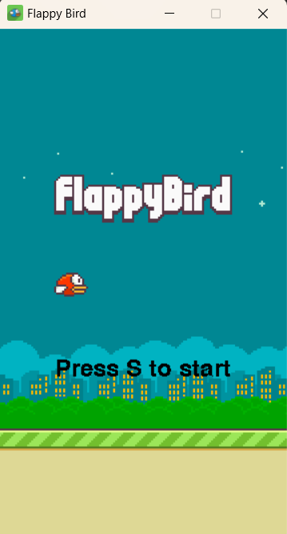
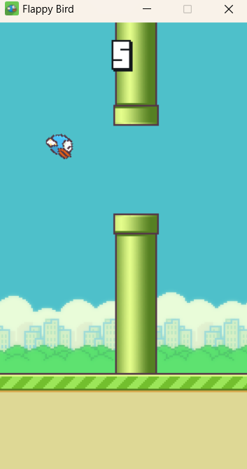
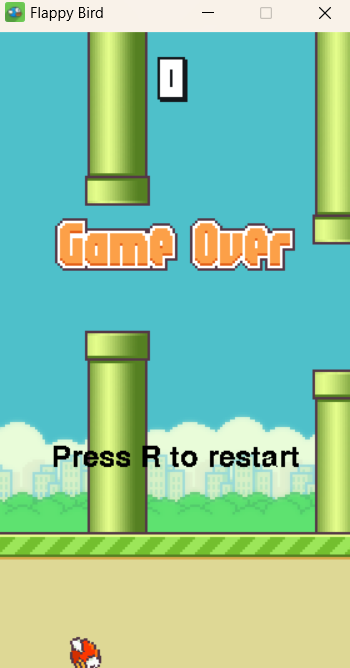

# Flappy Bird Clone - Pygame Project
Welcome to my Flappy Bird clone project created with Pygame! This project is an implementation of the classic Flappy Bird game.

## Project Screenshot
<div>
  
  
  
</div>

## YouTube Video
https://youtu.be/Ai5ZMinFQFw?si=IUHT3ZwCOh4Zurhs

## How to Play
- Press S to start the game.
- Press Enter to flap the bird.
- Press R to restart and return to the main screen after a game over.

## Features
- Dynamic Backgrounds: Different backgrounds that change randomly.
- Dynamic bird color: The bird changes color randomly and has flapping animation.
- Dynamic pipe color: Pipes come in different colors and spawn based on the background. Green for day and red for night background.
- Score Tracking: Increasing score when the bird successfully pass the pipes.
- Sound Effects: Includes sounds for flapping, passing pipes, and game over.

## Setup Instructions
**Clone the Repository:**

```
git clone https://github.com/YourUsername/your-repo-name.git
```

**Navigate to the Project Directory:**

```
cd your-repo-name
```

**Install Dependencies:**

```
pip install pygame
```

**Run the Game:**

```
python main.py
```
